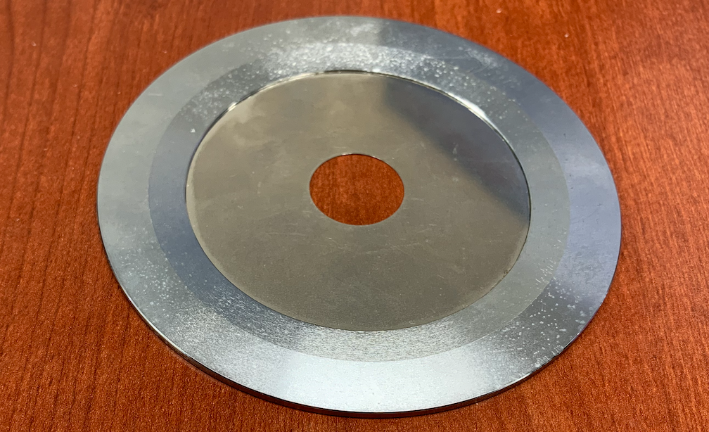
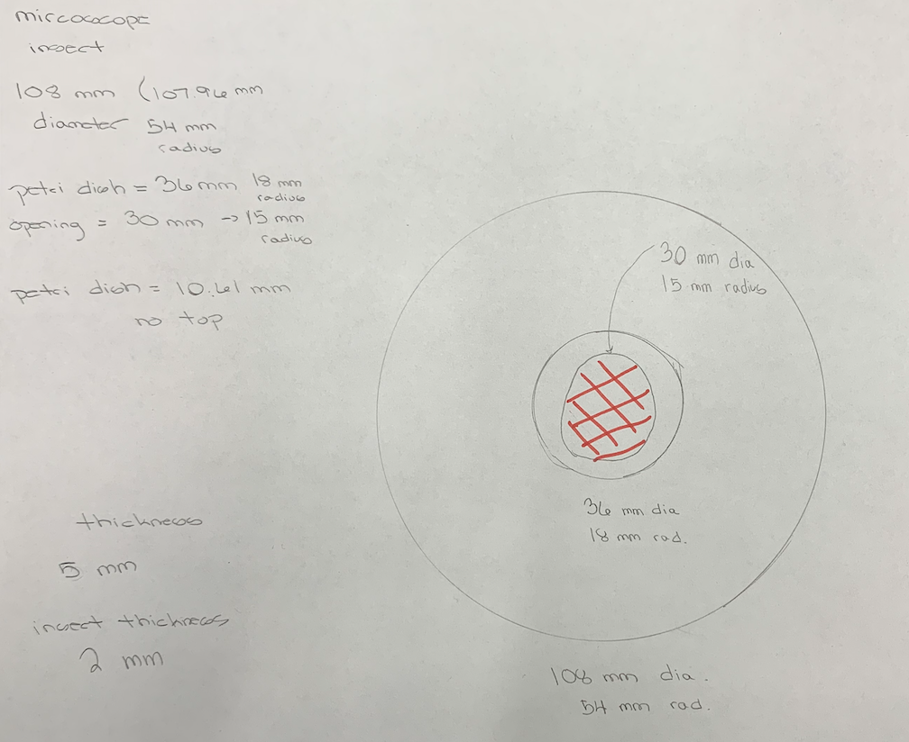
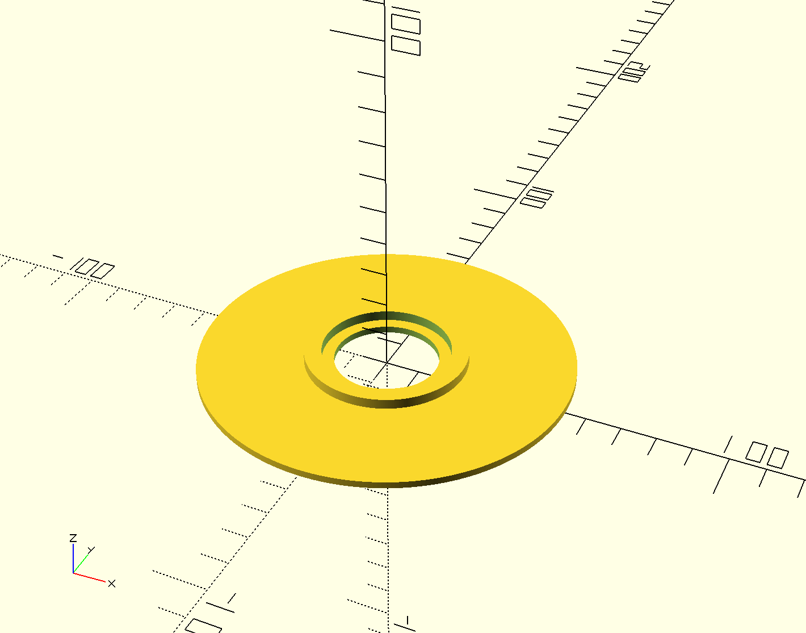
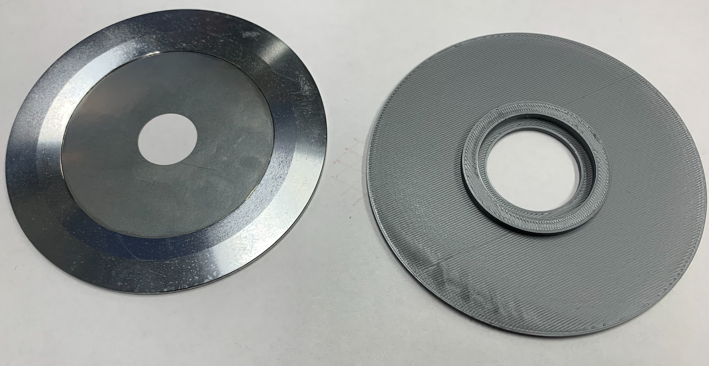
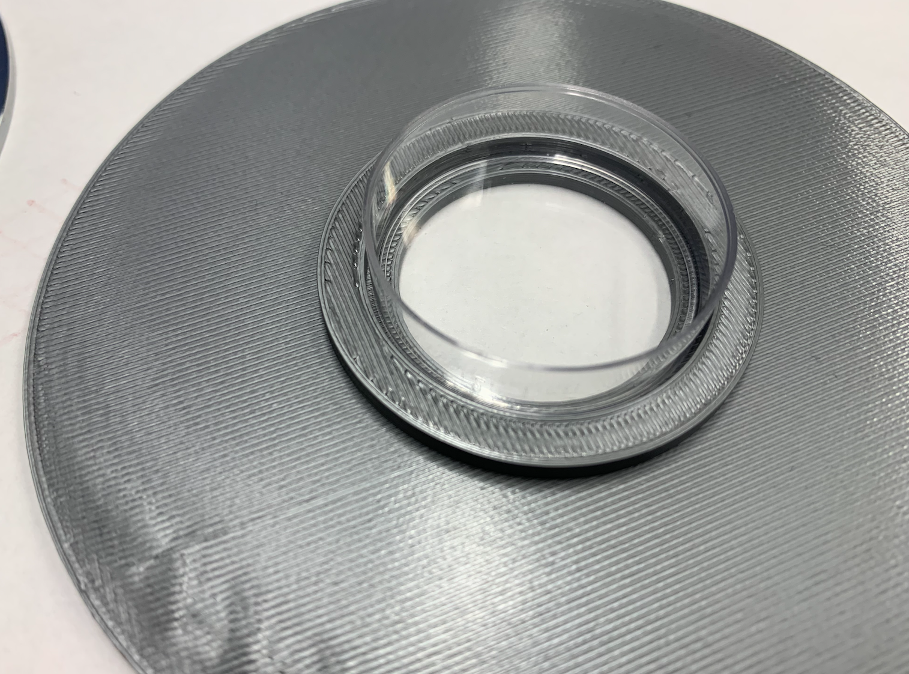

# Custom Microscope Stage Insert for Imaging Bacteria
* People: Wesley Chan, Colin Kinz-Thompson
* Date: March 2022
* Location: Rutgers University-Newark

## Overview:
Custom 3D printed microscope stage insert

## Information:
The stage insert on an old microscope did not have enough clearance to image an entire Petri dish without shifting the dish back and forth over the opening.



So we designed a new insert with an opening large enough opening to allow access to most of the dish and a lip to keep it centered over the opening.



We modeled the part in CAD using [OpenSCAD](https://openscad.org). Here's the code we used:

``` scad
$fn=300;

outer=54.0;
inner = 18.5; // 18.0 was a little too tight
hole = 15.0;
thickness = 5.0;
lip=2.0;

difference(){
    union(){
            difference(){
                cylinder(h=thickness,r=inner+5);
                cylinder(h=thickness,r=inner);
            }
            cylinder(h=lip,r=outer);
    }
    cylinder(h=thickness,r=hole);
}
```

The .scad file is [here](microscope_stage_insert_v1.scad), and the exported .stl file is [here](microscope_stage_insert_v2.stl). It looks like this:


Then we printed on our Prusa i3 MK3S+ that Wesley built from the kit. It turns out to be a very accurate print 

and it fits the Petri dish perfectly!


## Future
* Image bacteria!
* Adapt for Different Petri dish sizes
* Change z-height of dish to lower closer to objective