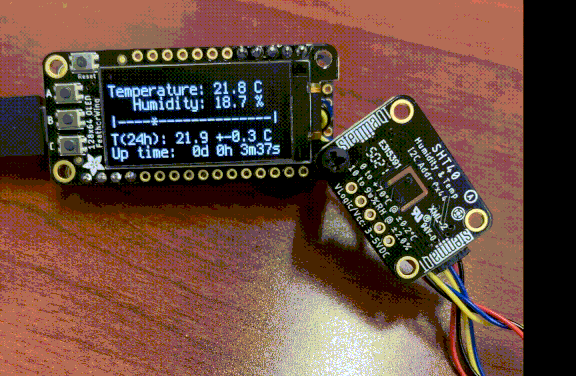

# Temperature and Humidity Sensor
* People: Colin Kinz-Thompson
* Date: May 2022
* Location: Rutgers University-Newark

## Overview:
A digital temperature and humidity monitor

## Information:
We needed to track the temperature and humidity in our microscope room, and commercial solutions were all a little too complicated. So, we decided to build our own. Using StemaQT sensors and a cortex M4 processor.

## Parts List 
* Feather M4 Express ([Adafruit](https://www.adafruit.com/product/3857)  \$23)

* Sensirion SHT40 Temperature & Humidity Sensor ([Adafruit] (https://www.adafruit.com/product/4885) \$6)
* STEMMA QT / Qwiic JST SH 4-pin to Premium Male Headers Cable - 150mm Long ([Adafruit](https://www.adafruit.com/product/4209) \$1; *note: would use a different one*)
* FeatherWing OLED - 128x64 OLED Add-on For Feather ([Adafruit](https://www.adafruit.com/product/4650) \$15)
* Short Feather Male Headers ([Adafruit](https://www.adafruit.com/product/3002) $0.50)

## Instructions
1. Solder some headers onto the M4 pins Rst through Gnd; they should face up
2. Solder some headers onto the M4 SDA through 9; they should face up
3. Cut the pins off STEMMA cable, and strip the wires
4. Make a loop on the end of the wires and place over pins: red to 3V, black to Gnd, blue to SDA, yellow to SCL; Solder them in place
5. Solder a single header in the prototyping area facing up. Bend it over like a hook. Wrap the wires around this once.
6. Place the OLED wing onto the headers, and solder them in place. 
7. Attach the SHT40 to the STEMMA QT cable, and plug a USB cable (with data pins!) into the M4. 
8. Double tap the reset button to send the M4 into boot mode. 
9. Download the circuit python .uc2 image file for the m4 express [here](https://circuitpython.org/board/feather_m4_express/)
10. Copy the uc2 file onto the mounted m4 folder
11. Eject and reset M4; it will mount again as a circuitpy folder
12. Copy the [code.py](code.py) and [./lib](lib) files onto the mounted folder
13. *Note: sometimes it will hang when booting up. Just hit reset.*

## Notes
The program uses an array to hold 24 hours of temperature data (taken every 60 seconds); it rolls over. This is what the average is calculated from. On initialization it prepopulates the entire array with the current temperature. This technically means it should take 24 hours to give you an accurate average. 

The gauge/bar is based on the min/max value ever seen. It goes beyond 24 hours to the total up time